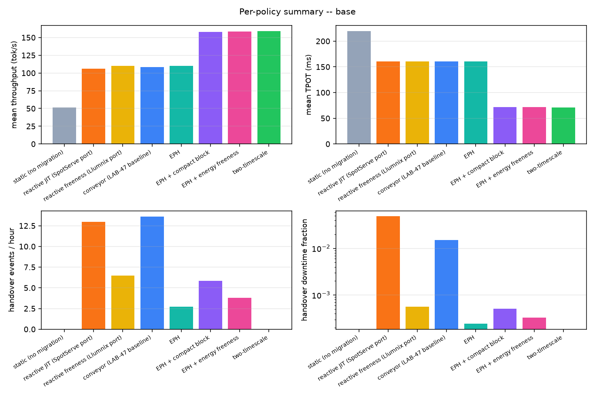
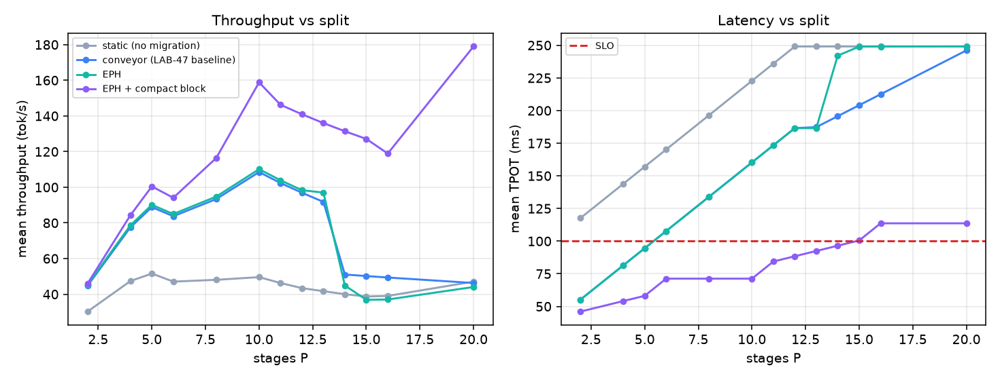
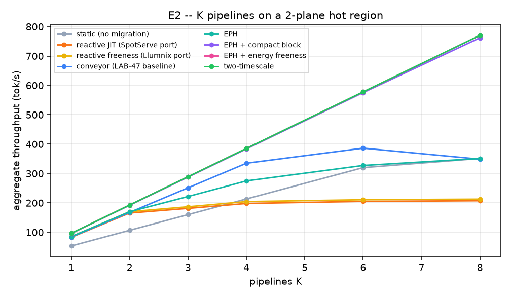
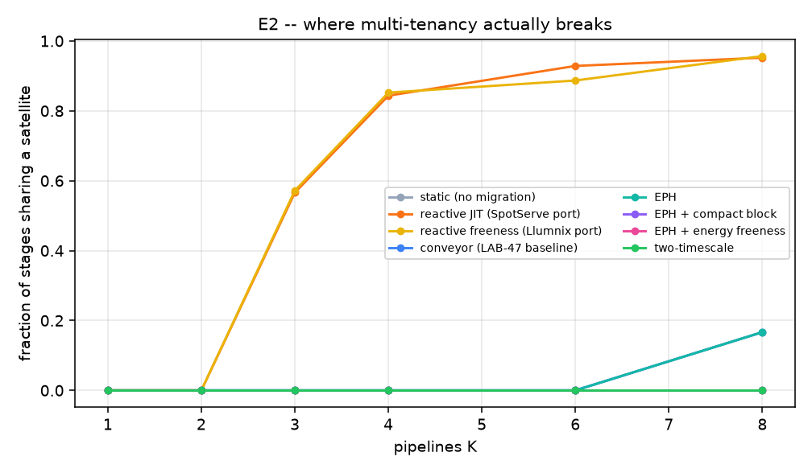
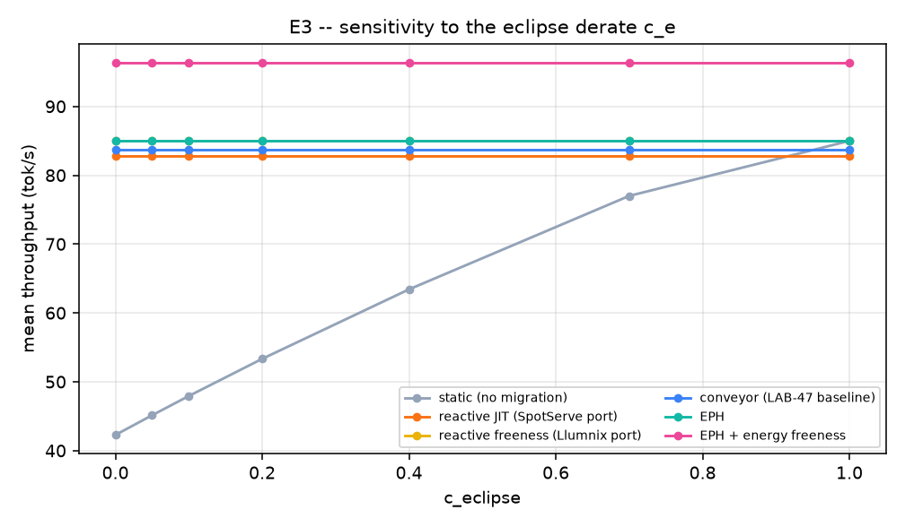
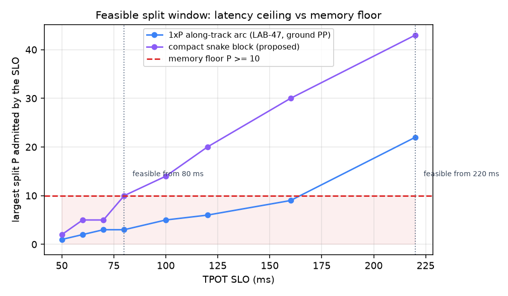
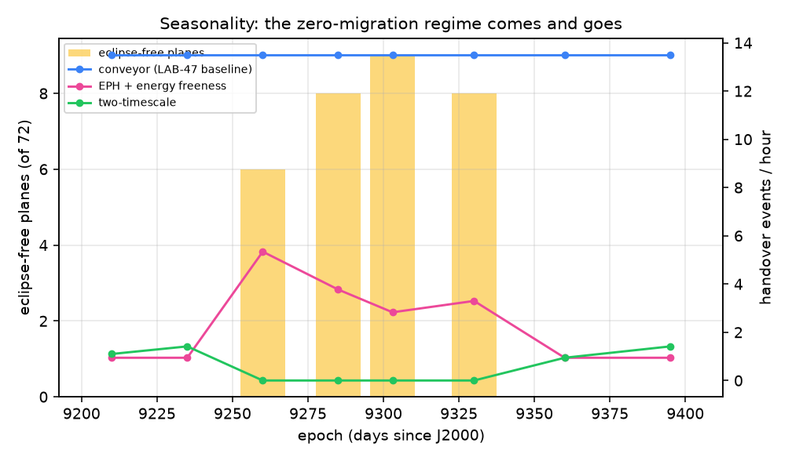
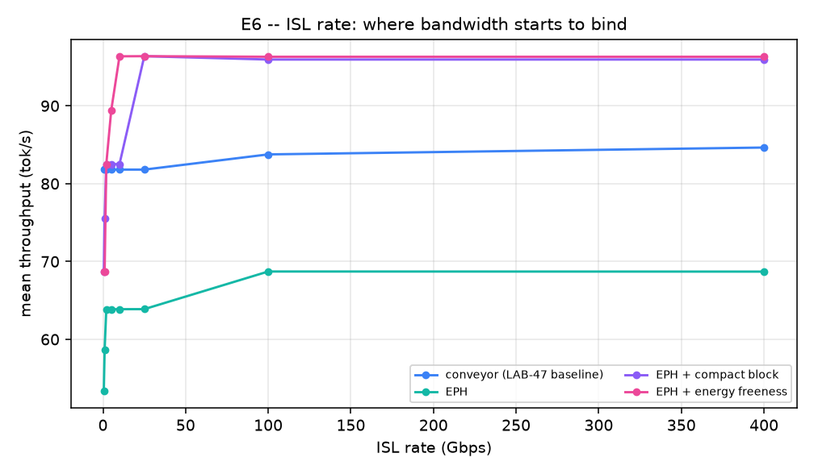

# satmig -- eclipse-aware live migration of LLM pipeline stages on a LEO shell

Every number below is regenerated by `python -m satmig all && python -m satmig report`.

## Constants this study rests on

| quantity | value |
|---|---|
| orbital period | 5730.1 s |
| slot advance T/N | 260.5 s |
| along-track ISL hop | 6.571 ms |
| cross-plane ISL hop | 2.014 ms |
| memory floor on P | 10 |
| eclipse-free planes | 8 |

## Base run (1 pipeline, P=10, 3 orbits)

| policy | P | P max @SLO | tok/s | TPOT ms | SLO att. | all-lit | events/h | downtime | battery Wh/orbit |
|---|---|---|---|---|---|---|---|---|---|
| static (no migration) | 10 | 5 | 51.2 | 219.3 | 0.000 | 0.239 | 0.0 | 0.0000% | 1676.4 |
| reactive JIT (SpotServe port) | 10 | 5 | 106.3 | 160.3 | 0.000 | 1.000 | 13.0 | 4.8721% | 0.0 |
| reactive freeness (Llumnix port) | 10 | 5 | 110.1 | 160.3 | 0.000 | 1.000 | 6.5 | 0.0562% | 0.0 |
| conveyor (LAB-47 baseline) | 10 | 5 | 108.5 | 160.3 | 0.000 | 1.000 | 13.6 | 1.5110% | 0.0 |
| EPH | 10 | 5 | 110.1 | 160.3 | 0.000 | 1.000 | 2.7 | 0.0242% | 0.0 |
| EPH + compact block | 10 | 14 | 157.8 | 71.9 | 0.992 | 0.992 | 5.9 | 0.0507% | 19.4 |
| EPH + energy freeness | 10 | 14 | 158.2 | 71.6 | 0.995 | 0.995 | 3.8 | 0.0326% | 9.2 |
| two-timescale | 10 | 14 | 158.8 | 71.3 | 1.000 | 1.000 | 0.0 | 0.0000% | 0.0 |

## E1 -- split sweep

Throughput rises with P while latency rises faster; the useful
reading is where each curve crosses the SLO line.

## E2 -- multi-pipeline contention

| K | conveyor agg tok/s | eph_freeness agg tok/s | conveyor coloc. | eph_freeness coloc. | peak ISL flows |
|---|---|---|---|---|---|
| 1 | 83.8 | 96.4 | 0.000 | 0.000 | 2 |
| 2 | 167.5 | 192.7 | 0.000 | 0.000 | 2 |
| 3 | 251.3 | 288.9 | 0.000 | 0.000 | 2 |
| 4 | 335.0 | 385.2 | 0.000 | 0.000 | 2 |
| 6 | 386.3 | 577.5 | 0.000 | 0.000 | 2 |
| 8 | 348.8 | 770.3 | 0.167 | 0.000 | 2 |

## E3 -- how much depends on the battery derate

At c_e = 1 the battery carries full compute and every migration
policy collapses onto `static`; at c_e = 0 the gap is maximal.
Every ratio elsewhere in this report should be read against this
curve.

## E4 -- the feasible split window

| SLO ms | P max, 1xP arc | P max, snake | memory floor | snake feasible? | arc feasible? |
|---|---|---|---|---|---|
| 50 | 1 | 2 | 10 | no | no |
| 60 | 2 | 5 | 10 | no | no |
| 70 | 3 | 5 | 10 | no | no |
| 80 | 3 | 10 | 10 | yes | no |
| 100 | 5 | 14 | 10 | yes | no |
| 120 | 6 | 20 | 10 | yes | no |
| 160 | 9 | 30 | 10 | yes | no |
| 220 | 22 | 43 | 10 | yes | yes |

## E5 -- seasonality

The number of eclipse-free planes in a 53 deg shell is a function
of solar declination, so the two-timescale policy's zero-migration
regime exists near solstice and vanishes near equinox.

## E6 -- is the ISL the bottleneck?

A single-hop lockstep shift gives every stage the full link, so
`conveyor` never misses a deadline.  A batched J-hop jump routes P
transfers over the same J links, so it needs roughly `P/J` times
more headroom -- which is why the jump distance has to be chosen
against the link rate, not just the arc slack.

| ISL Gbps | conveyor tok/s | eph_freeness tok/s | eph_freeness misses | conveyor misses |
|---|---|---|---|---|
| 0.5 | 81.8 | 68.6 | 11424 | 0 |
| 1.0 | 81.8 | 68.6 | 11076 | 0 |
| 2.0 | 81.8 | 82.5 | 5268 | 0 |
| 5.0 | 81.8 | 89.4 | 2572 | 0 |
| 10.0 | 81.8 | 96.4 | 0 | 0 |
| 25.0 | 81.8 | 96.4 | 0 | 0 |
| 100.0 | 83.8 | 96.3 | 0 | 0 |
| 400.0 | 84.6 | 96.3 | 0 | 0 |

## Credibility tiers

**Cross-checked against independent derivations in this lab** -- orbital
period, critical beta angle (67.0 deg), eclipse fraction at beta=0
(0.372), per-plane beta spread, the closed-form `p_full`, the KV-only
handover bubble (~1.4%) and the ~162 Wh per satellite per orbit of
eclipse compute energy.  These agree with LAB-47 / LAB-58 / LAB-67,
which reached them with satellite.js + SGP4 rather than closed forms.

**Ported from published work, parameters taken as given** -- CONNEX's
11.1 ms pair-local cutover and its ~50x slower global rebuild;
PipeLive's MaxBlocks feasibility test, layer-stacking granularity and
incremental KV patching; SCOPE's Eq. 1-3; SpotServe's KM device mapping
and 30 s grace period; Llumnix's freeness formula.

**Our assumptions, not measured** -- normalised compute capacity as a
power proxy, the eclipse derate `c_e` (see E3), per-layer decode time
calibrated to a 42 ms whole-model decode step, 24 GB of usable memory
per satellite, and the KV dirty rate that sets pre-copy convergence.

**Not modelled** -- attitude and panel incidence (so no-power time here
is a lower bound), battery state of charge, penumbra, atmospheric
drag, J2 short-period terms, prefill/decode mixing, request arrivals,
and sub-slot queueing.
